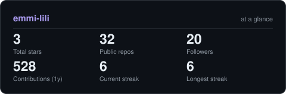
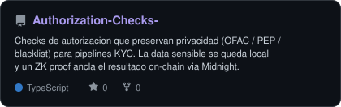
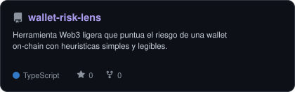
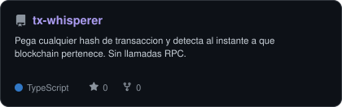
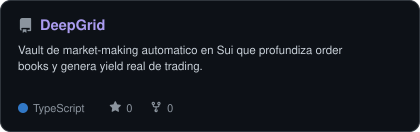

<!-- PORTRAIT - monochrome #aa9bef dot matrix, generated by scripts/dotify.py.
     A dark/light pair swapped via <picture> + prefers-color-scheme. Regenerate with:
       python scripts/dotify.py path/to/photo.png -o assets/portrait \
         --cols 100 --equalize --detail 0.5 -->
<picture>
  <source media="(prefers-color-scheme: dark)"  srcset="assets/portrait-dark.svg">
  <source media="(prefers-color-scheme: light)" srcset="assets/portrait-light.svg">
  
</picture>

 

<!-- NAME / TAGLINE - animated typing -->

 

<!-- SOCIALS -->

---

## `// quién transmite`

Soy **Emmi** — blockchain engineer y tech lead, transmitiendo desde La Paz. Construyo la infraestructura que mueve activos digitales y me obsesiona que la gente normal pueda usarla sin miedo.

- Vivo en la **arquitectura de wallets** e **infraestructura de digital assets**: custodia, firmas, el detalle aburrido-pero-crítico que hace que todo lo demás sea seguro.
- Mi terreno es **Stellar / Soroban** y **smart contracts**, con **Next.js + TypeScript** cuando el producto necesita cara.
- Me atraen los proyectos donde la **privacidad** pesa: checks que dejan la data sensible en local y ZK proofs que solo revelan lo justo.
- Háblame de **Web3 en LATAM** y tienes toda mi atención.

 

## `// stack`

---

## `// radar de señal`

<table>
<tr>
<td width="50%" align="center" valign="middle">

<!-- Self-rated radar - edit assets/skills.json, the workflow redraws it -->
<picture>
  <source media="(prefers-color-scheme: dark)"  srcset="assets/radar-dark.svg">
  <source media="(prefers-color-scheme: light)" srcset="assets/radar-light.svg">
  
</picture>

</td>
<td width="50%" align="center" valign="middle">

<!-- Hand-authored contract & language stack radar - edit assets/langmix.json -->
<picture>
  <source media="(prefers-color-scheme: dark)"  srcset="assets/radar-langs-dark.svg">
  <source media="(prefers-color-scheme: light)" srcset="assets/radar-langs-light.svg">
  
</picture>

</td>
</tr>
</table>

---

## `// los números`

<!-- Generated by scripts/cards.py into this repo. Deliberately NOT
     github-readme-stats / streak-stats / github-profile-trophy: those are
     shared public instances that go down and take the whole section with them. -->
<picture>
  <source media="(prefers-color-scheme: dark)"  srcset="assets/card-stats-dark.svg">
  <source media="(prefers-color-scheme: light)" srcset="assets/card-stats-light.svg">
  
</picture>

 

  

---

## `// transmisiones`

<!-- Cards generated by scripts/cards.py from assets/projects.json.
     Stars, forks and language are pulled live from the API on every run. -->
<table>
<tr>
<td width="50%">
  <a href="https://github.com/emmi-lili/Authorization-Checks-">
    <picture>
      <source media="(prefers-color-scheme: dark)"  srcset="assets/card-Authorization-Checks--dark.svg">
      <source media="(prefers-color-scheme: light)" srcset="assets/card-Authorization-Checks--light.svg">
      
    </picture>
  </a>
</td>
<td width="50%">
  <a href="https://github.com/emmi-lili/wallet-risk-lens">
    <picture>
      <source media="(prefers-color-scheme: dark)"  srcset="assets/card-wallet-risk-lens-dark.svg">
      <source media="(prefers-color-scheme: light)" srcset="assets/card-wallet-risk-lens-light.svg">
      
    </picture>
  </a>
</td>
</tr>
<tr>
<td width="50%">
  <a href="https://github.com/emmi-lili/tx-whisperer">
    <picture>
      <source media="(prefers-color-scheme: dark)"  srcset="assets/card-tx-whisperer-dark.svg">
      <source media="(prefers-color-scheme: light)" srcset="assets/card-tx-whisperer-light.svg">
      
    </picture>
  </a>
</td>
<td width="50%">
  <a href="https://github.com/emmi-lili/DeepGrid">
    <picture>
      <source media="(prefers-color-scheme: dark)"  srcset="assets/card-DeepGrid-dark.svg">
      <source media="(prefers-color-scheme: light)" srcset="assets/card-DeepGrid-light.svg">
      
    </picture>
  </a>
</td>
</tr>
</table>

| project | stack |
|---|---|
| **[Authorization-Checks](https://github.com/emmi-lili/Authorization-Checks-)** | `TypeScript` `Midnight` `ZK` |
| **[wallet-risk-lens](https://github.com/emmi-lili/wallet-risk-lens)** | `TypeScript` `Web3` |
| **[tx-whisperer](https://github.com/emmi-lili/tx-whisperer)** | `TypeScript` |
| **[DeepGrid](https://github.com/emmi-lili/DeepGrid)** | `TypeScript` `Sui` `Move` |

---

`— fin de transmisión · construido en La Paz, Bolivia · @emmcriptada —`

